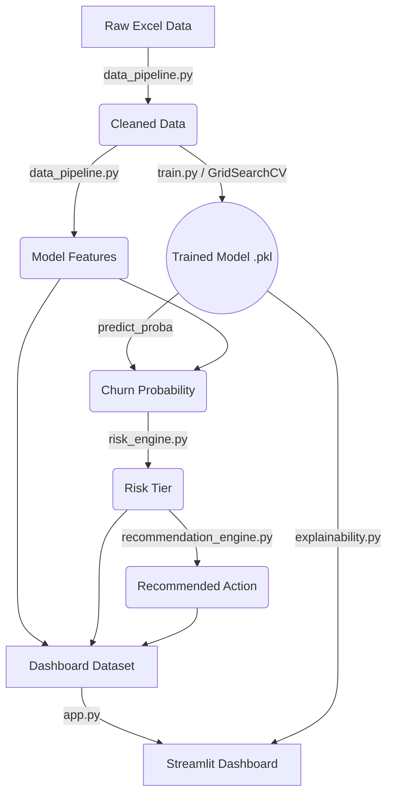

<div align="center">

# 📊 AI Customer Retention Analytics Platform

**Predictive churn intelligence, risk segmentation, and explainable retention recommendations.**

[](https://www.python.org/downloads/)
[](https://streamlit.io/)
[](https://scikit-learn.org/)
[](https://shap.readthedocs.io/)
[](https://opensource.org/licenses/MIT)

</div>

---

## 📖 Project Overview

Telecom companies lose a meaningful share of revenue every year to avoidable customer churn. This project is an end-to-end machine learning system that not only predicts customer churn but translates those predictions into actionable business insights.

The platform provides a complete retention pipeline:
**Raw data → Data Cleaning → ML Modeling → Risk Scoring → Explainability (SHAP) → Retention Recommendation → Interactive Dashboard**

Built on the IBM Telco Customer Churn dataset (7,043 customers), this project demonstrates production-grade ML engineering, clear separation of concerns, and executive-level business storytelling.

---

## 🎯 Business Problem & Solution

**The Problem:** Customer support and retention teams often operate reactively. When they do use predictive scores, the models are usually "black boxes," leaving agents without a concrete reason *why* a customer is at risk or *what* to do about it.

**The Solution:** This platform bridges the gap between predictive modeling and business action:
1.  **Risk Tiering:** Segments customers into Low, Medium, High, and Critical risk tiers.
2.  **Explainability (SHAP):** Uncovers the specific features driving an individual customer's churn score.
3.  **Auditable Actions:** Provides concrete, rule-based retention recommendations (e.g., "Priority retention call + Loyalty reward") keyed on risk tier, contract type, and monthly spend.

---

## ✨ Feature Highlights

- **Predictive Engine:** Churn prediction via a tuned scikit-learn Random Forest model.
- **Explainable AI (XAI):** Global feature importance and per-customer SHAP waterfall plots for deep model transparency.
- **Executive Dashboard:** An interactive, dark-themed Streamlit application featuring KPI cards, dynamic business insights, and Plotly visualizations.
- **Rule-Based Recommendations:** A transparent, business-friendly recommendation engine that translates risk into action.
- **Self-Healing Data Layer:** If the processed dataset is missing, the app automatically regenerates it from the raw data and trained model.
- **Robust Model Governance:** Built-in validation of model metadata (schema, versions, training config) before serving predictions.

---

## 🛠️ Technology Stack

- **Machine Learning:** `scikit-learn` (Pipeline, ColumnTransformer, RandomForestClassifier, GridSearchCV)
- **Explainability:** `SHAP` (TreeExplainer)
- **Dashboard & UI:** `Streamlit`, `Plotly`, `Matplotlib`
- **Data Manipulation:** `pandas`, `NumPy`
- **Testing:** `pytest`

---

## 🏗️ Architecture & Data Flow



*(Note: The pipeline strictly separates the training logic, the scoring logic, and the presentation layer. No business logic is duplicated in the Streamlit app.)*

---

## 📂 Folder Structure

```text
AI-Customer-Retention-Analytics/
├── dashboard/
│   └── app.py                    # Streamlit dashboard (presentation layer only)
├── src/
│   ├── config.py                 # Paths, feature schema, thresholds — single source of truth
│   ├── data_pipeline.py          # Load / clean / dashboard dataset generation
│   ├── feature_engineering.py    # Business-facing analytics features (dashboard only)
│   ├── model.py                  # Model load / predict / feature importance
│   ├── risk_engine.py            # Probability → risk tier
│   ├── recommendation_engine.py  # Risk tier → retention action
│   ├── explainability.py         # SHAP wrappers
│   ├── train.py                  # End-to-end, CLI-runnable training script
│   └── utils.py                  # Logging + friendly missing-file errors
├── data/
│   ├── raw/                      # Telco_customer_churn.xlsx
│   └── processed/                # dashboard_data.csv (auto-regenerated if missing)
├── models/
│   ├── customer_churn_model.pkl  # Trained sklearn Pipeline
│   └── model_metadata.json       # Model governance and schema validation
├── notebooks/
│   └── 01_Data_Understanding.ipynb  # EDA, model comparison, SHAP workflow
├── docs/
│   ├── architecture.md              # System architecture and production notes
│   ├── data_card.md                 # Dataset assumptions, target, and limitations
│   └── model_card.md                # Model metrics, intended use, and governance
├── screenshots/                  # Dashboard screenshots (see screenshots/README.md)
├── tests/                        # pytest unit tests for the ML modules
├── requirements.txt
└── .gitignore
```

---

## 🚀 Installation & Usage

### 1. Setup the Environment

```bash
git clone <your-repo-url>
cd AI-Customer-Retention-Analytics

# Create and activate a virtual environment (e.g. venv)
python3 -m venv venv
source venv/bin/activate        # On Windows: venv\Scripts\activate

pip install -r requirements.txt
```

### 2. Run the Dashboard

```bash
streamlit run dashboard/app.py
```
> **Self-Healing Note:** On the first run, if `data/processed/dashboard_data.csv` isn't present, the app will automatically score the full customer base using the trained model in `models/customer_churn_model.pkl`.

### 3. Retrain the Model (Optional)

```bash
python -m src.train              # Full GridSearchCV (matches notebook exactly)
python -m src.train --fast       # Single fit with known-good params (fast iteration)
```

### 4. Run Tests

```bash
pytest tests/ -v
```

---

## 📊 Dashboard Visuals

> **Placeholder:** High-resolution screenshots of the dashboard tabs (Overview, Customers & Risk, Explainability, Business Insights) go here.
> *To generate screenshots, run the Streamlit app locally and capture the browser window.*

- **Overview Tab:** Executive KPI summary and risk distribution charts.
- **Customers & Risk Tab:** Filterable data table of high-risk customers with concrete retention recommendations.
- **Explainability Tab:** Interactive SHAP waterfall plots explaining individual customer risk scores.

---

## 📈 ML Performance & Business Impact

Held-out test set (1,409 customers, 20% split, `random_state=42`) evaluated directly against the shipped `customer_churn_model.pkl`:

| Metric | Value |
|---|---|
| Accuracy | 0.805 |
| ROC-AUC | 0.851 |
| PR-AUC | 0.670 |
| Precision (churn class) | 0.659 |
| Recall (churn class) | 0.548 |
| F1 (churn class) | 0.599 |

**Business Interpretation:**
While recall on the churn class (0.548) indicates the model misses some churners (a known trade-off of standard F1 optimization on an imbalanced dataset), the **Explainability** tab and adjustable risk thresholds in `src/risk_engine.py` allow retention teams to strategically trade precision for recall based on business costs (Customer Acquisition Cost vs. Retention Campaign Cost).

---

## ☁️ Deployment (Streamlit Community Cloud)

1. Push this repository to GitHub.
   *(Note: `.gitignore` excludes local/venv artifacts. `data/`, `models/`, and `notebooks/` are intentionally included for the dashboard runtime).*
2. Navigate to [share.streamlit.io](https://share.streamlit.io) and create a new app pointing at this repository.
3. Set the main file path to `dashboard/app.py`.
4. Deploy! No environment variables or secrets are required.

---

## 🗺️ Future Roadmap

- **Cost-Sensitive Learning:** Introduce class weights (`class_weight='balanced'`) or threshold tuning tied directly to a business cost matrix to improve recall for high-value customers.
- **Batch Pipeline Orchestration:** Transition synchronous dashboard data regeneration to an asynchronous Airflow or Prefect pipeline for handling larger datasets.
- **Enhanced UI Testing:** Implement Streamlit `AppTest` to automate presentation layer testing alongside the backend ML tests.
- **Model Registry:** Integrate MLflow for robust experiment tracking and model versioning across retrains.

---
*Built as a flagship portfolio project demonstrating end-to-end ML engineering, clean architecture, and executive-ready data products.*
